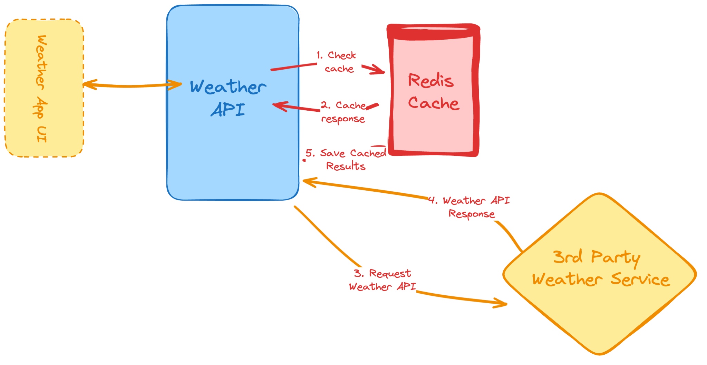
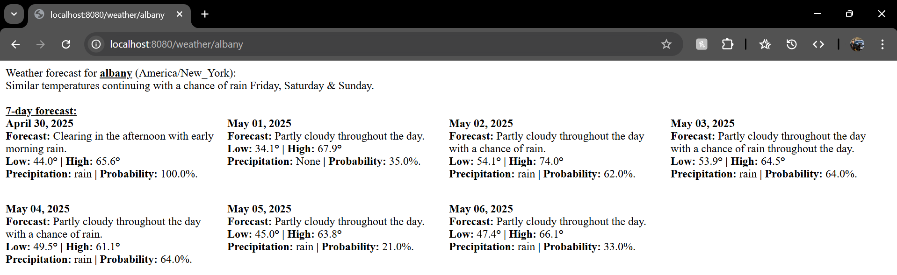
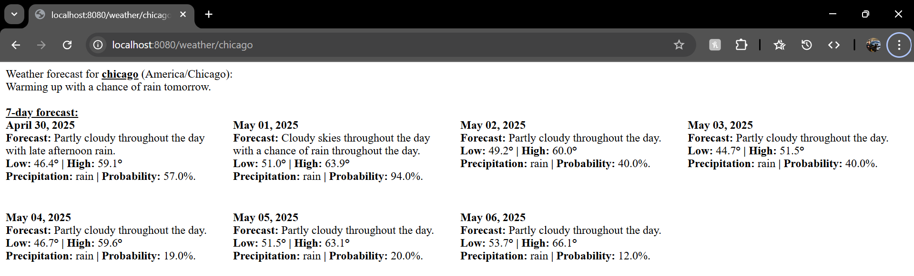
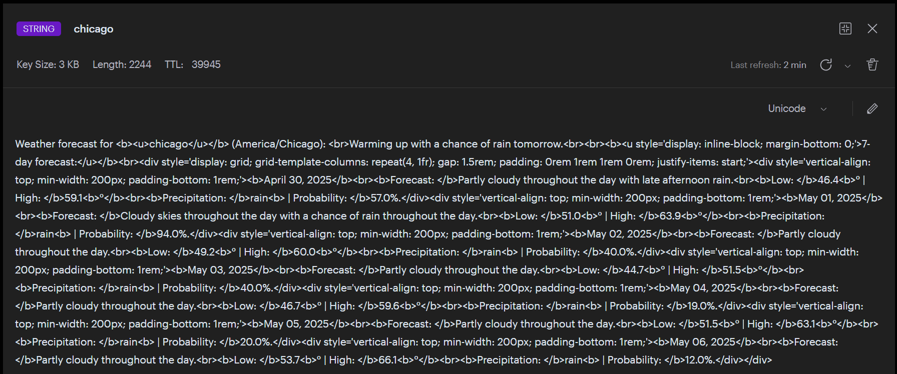

# Weather Forecast API with Redis Caching
This project is a solution to the *Weather API Wrapper Service* challenge on [Roadmap.sh](https://roadmap.sh/projects/weather-api-wrapper-service), designed to help developers practice 3rd-party API integration, caching with Redis, and secure use of environment variables.

### About the Challenge

In this project, we will build a weather API that fetches and returns weather data from a 3rd-party API (e.g., [Visual Crossing's](https://www.visualcrossing.com/)). The challenge encourages developers to implement a caching layer with [Redis](https://redis.io/) to reduce the number of external API calls made and improve performance, particularly by caching responses based on user-entered city codes.
*- Adapted from Roadmap.sh*

## Solution Overview
This Spring Boot application implements a solution to the challenge, including the following features:
- Retrieves a 7-day weather forecast for a user-provided location from the [Visual Crossing Weather API](https://www.visualcrossing.com/weather-api/).
- Caches results using Redis (to reduce API calls and improve performance).
- Exposes a simple API that returns a clean HTML output.
- Secures all API keys and connection details via `resources/application.properties`.

### Tech Stack
- *Java / Spring Boot* - The backend framework for building the weather API.
- *Maven* - Dependency management and build tool.
- *Redis (via Redis Cloud)* - In-memory data store used to cache weather API responses.
- *Visual Crossing Weather API* - The external API used for retrieving forecast data.

### Forecast Output (Albany/Chicago)

### RedisInsight - Cached Forecast (Chicago)

